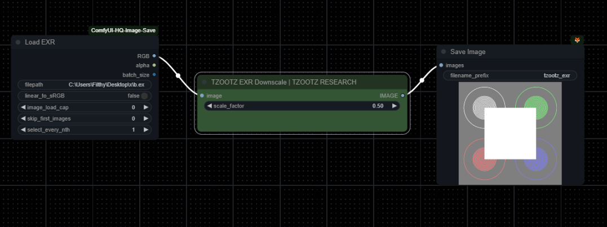

ComfyUI_TZOOTZEXR
ComfyUI EXR Node by TZOOTZ Research 2024®

Welcome to the official TZOOTZ EXR Node repository, a tool designed to bring advanced EXR file handling into the ComfyUI environment. Developed by TZOOTZ Research, this node is perfect for artists and experimental projects requiring precise control over HDR workflows.

Overview
The ComfyUI_TZOOTZEXR node by TZOOTZ Research allows for EXR file loading and downscaling with high fidelity. With this node, users can maintain floating-point accuracy and preserve highlights during downscaling, ensuring that visual integrity remains uncompromised.

Features
- **EXR File Loading**: Import EXR files with complete HDR metadata.
- **Floating-Point Precision**: Downscale without compromising highlights or brightness, maintaining true-to-source quality.
- **Custom Scaling Factor**: Set your preferred downscaling level to fit specific project requirements.
- **Seamless Integration**: Fully compatible with ComfyUI workflows for an intuitive experience.

Screenshot
Below is a screenshot of the TZOOTZ EXR Node in action within ComfyUI:

Requirements
Ensure that the following dependencies are installed:
- OpenEXR
- Imath
- Pillow
- numpy

Installation

1. Clone the repository into your ComfyUI custom nodes directory:
   git clone https://github.com/yourusername/ComfyUI_TZOOTZEXR.git

2. Navigate to the ComfyUI directory where ComfyUI is installed. Example:
   cd "C:\Users\Filthy\Desktop\IA LAB\ComfyUI_windows_portable"

3. Install the required dependencies from the `requirements.txt` file:
   pip install -r custom_nodes/ComfyUI_TZOOTZEXR/requirements.txt
   
TZOOTZ Research 2024® TZOOTZ Research is committed to developing innovative tools that push the boundaries of digital creativity. With a focus on quality and precision, TZOOTZ Research enables artists to achieve unparalleled results in their work.

For more information about our work and future projects, reach out to TZOOTZ Research.  www.tzootz.com
